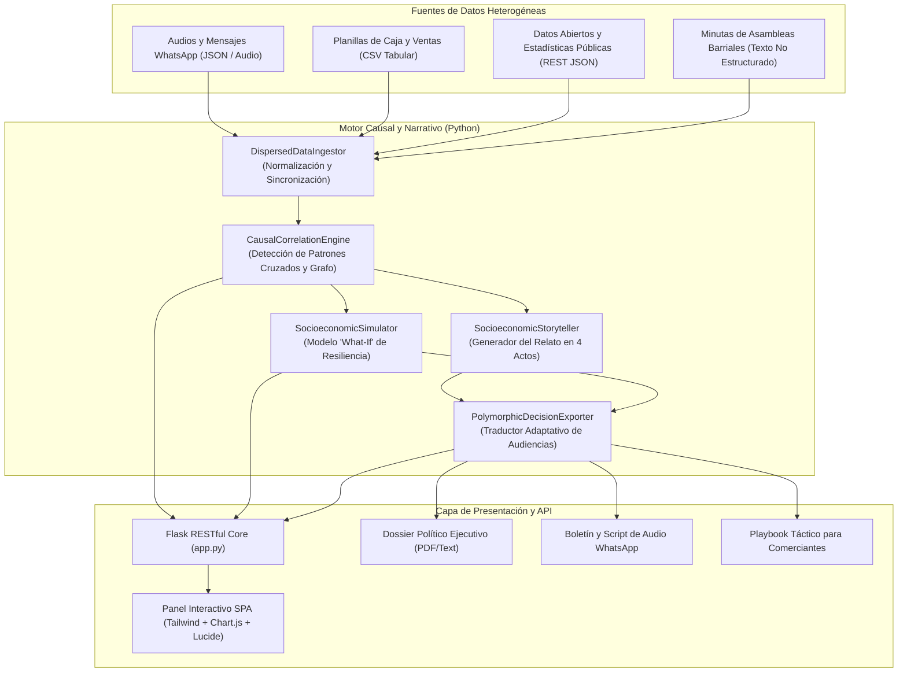

# Arquitectura Técnica de Síntesis Viva

Síntesis Viva implementa una arquitectura modular desacoplada diseñada para procesar fuentes de datos heterogéneas, ejecutar inferencia de causalidad cruzada y servir interfaces reactivas de alta velocidad.

## 1. Diagrama de Arquitectura del Sistema

## 2. Componentes Principales

### 2.1 Módulo de Ingesta (`engine/ingestion.py`)
Normaliza 4 tipos de datos heterogéneos:
* **Señales Cualitativas (WhatsApp):** Extrae tono emocional, canal de procedencia y categorización temática.
* **Métricas Cuantitativas (CSV):** Procesa series de tiempo de ventas nominales, costo de reposición, cálculo de margen comercial real y aceleración del fiado informal acumulado.
* **Métricas Públicas (JSON):** Consolida datos del Sistema Integrado de Estadísticas Territoriales (SIET), identificando partidas presupuestarias subejecutadas.
* **Registros Deliberativos (TXT):** Normaliza intervenciones orales en actas vecinales.

### 2.2 Motor de Correlación Causal (`engine/causal_graph.py`)
Cruza señales de diferentes dominios para inferir cuellos de botella no evidentes:
* Cruza la alerta de desabastecimiento de WhatsApp con la inflación de fletes del gobierno abierto.
* Demuestra que el alza nominal en ventas esconde una caída a terreno negativo del margen real (-0.9%).
* Vincula la falta de liquidez barrial (fiado +190%) con la existencia de fondos públicos inactivos ($10.2M ARS).

### 2.3 Simulador Socioeconómico (`engine/simulator.py`)
Modela matemáticamente el impacto de 3 palancas:
1. **Tasa de Compra Colectiva (\%):** Reduce el sobrecosto de fletes atomizados hasta en un 32%.
2. **Fondo Rotatorio de Garantía (ARS):** Amortigua la morosidad vecinal y previene la quiebra del capital de trabajo.
3. **Desbloqueo de Subsidio Municipal (\%):** Moviliza fondos públicos estancados para financiar rutas de transporte consolidado.

### 2.4 Exportador Polimórfico (`engine/polymorphic_exporter.py`)
Genera 3 salidas personalizadas con la misma verdad fáctica subyacente:
* **Dossier Ejecutivo:** Dirigido a intendencias y bancos con indicadores de retorno social de inversión (S-ROI).
* **Guión de Audio para WhatsApp:** Formato coloquial, directo y convocante para vecinos y comedores.
* **Playbook Táctico:** Hoja de ruta operativa semana a semana para los comerciantes.
