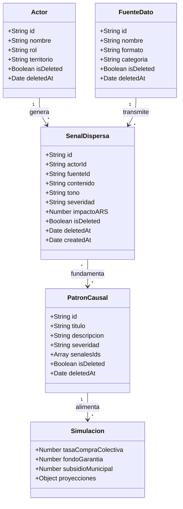
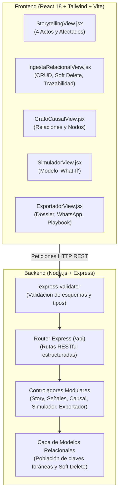

# Arquitectura Técnica de Síntesis Viva (Stack JavaScript)

## 1. Diagrama de Arquitectura y Relaciones entre Modelos

---

## 2. Flujo de Datos y Capas del Sistema

---

## 3. Características Técnicas Implementadas

### 3.1 Modelado Relacional
* **Actor ➡️ Señal (1:N):** Cada señal territorial se vincula explícitamente a un actor de la comunidad (Doña Marta, Taller Carlos, Comedor Laura, Secretaría Municipal).
* **Fuente ➡️ Señal (1:N):** Identifica el canal de procedencia (WhatsApp, CSV, Datos Abiertos, Minutas).
* **Señales ➡️ Patrones Causales (N:M):** Los patrones de correlación cruzada se construyen asociando múltiples señales territoriales.

### 3.2 Eliminación Lógica (Soft Delete)
* En cumplimiento estricto con los requerimientos, los registros no se eliminan físicamente de la base de datos (`DELETE FROM`).
* Se utiliza el patrón `isDeleted: true` junto con una marca de tiempo `deletedAt: ISOString`.
* Las consultas operativas filtran automáticamente `!isDeleted`.
* El endpoint de auditoría (`GET /api/senales?includeDeleted=true`) y el endpoint de restauración (`PATCH /api/senales/:id/restore`) permiten auditar y recuperar cualquier información comunitaria en caso de error.

### 3.3 Validación de Datos con `express-validator`
* **Validación de longitud y presencia:** El contenido de las señales debe contener entre 10 y 500 caracteres.
* **Validación de catálogo y rangos:** La severidad debe ser `baja`, `media`, `alta` o `critica`. Las tasas del simulador se verifican en el rango estricto de `0` a `100%`.
* **Respuestas consistentes:** En caso de discrepancia, se emite un código `400 Bad Request` con un listado detallado de campos y mensajes amigables.
