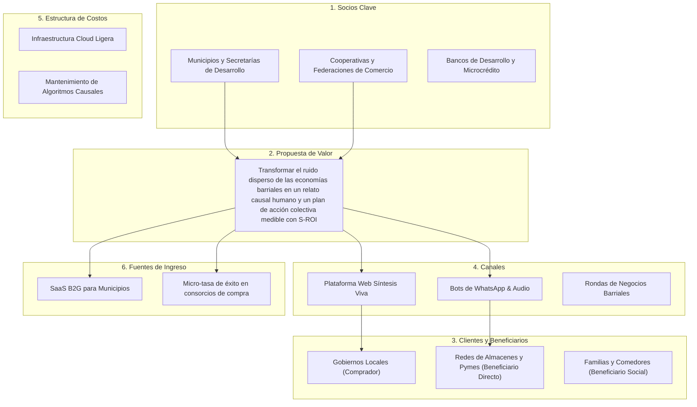

# Guión de Pitch y Defensa para el Jurado de la Hackathon 🏆
## Proyecto: SÍNTESIS VIVA

---

## ⏱️ 1. Elevator Pitch (30 Segundos)

> *"¿Sabían que en nuestros barrios los pequeños comercios no quiebran por falta de trabajo, sino por ceguera informativa? Mientras una almacenera trabaja a pérdida por pagar fletes atomizados, en la municipalidad sobran millones de pesos en fondos que vencen sin ejecutarse por falta de proyectos con datos.  
> Creamos **Síntesis Viva**, un motor de inteligencia colectiva que ingesta audios de WhatsApp, planillas de almacén y datos oficiales, descubre las causas ocultas del colapso territorial y genera con un solo clic el plan de compras comunitarias y el dossier para liberar los fondos públicos. Convertimos el caos de información dispersa en soberanía económica real."*

---

## 🎙️ 2. Guión de Pitch Principal (3 Minutos - Palabra por Palabra)

### Minuto 0:00 - 0:45 | El Gancho Humano (Storytelling)
*(Diapositiva 1: Foto del local de Doña Marta con los hornos apagados y captura de audio de WhatsApp)*

"Buenas tardes al jurado. Les presento a Doña Marta. Hace 24 años atiende su panadería en el barrio El Progreso.
El viernes pasado a las 5 de la mañana, los hornos de Doña Marta estaban apagados.  
¿Por qué? En su teléfono tenía tres audios de transportistas quejándose porque el flete de la harina subió un 28%. En su mostrador, el cuaderno de fiados acumulaba más de $630.000 pesos de vecinos que ya no tienen efectivo para pagar.  
Y al mismo tiempo, a solo 10 cuadras de allí, en la página web del Municipio, una partida de $10 millones de pesos para apoyo logístico a pymes permanecía 100% inactiva por 'falta de proyectos viables formulados'.  
Tres realidades ocurriendo al mismo tiempo, desconectadas porque sus datos viven en tres formatos incompatibles: un audio efímero de WhatsApp, un cuaderno de papel y un boletín burocrático en PDF."

### Minuto 0:45 - 1:30 | El Problema Sistémico (Causa Raíz)
*(Diapositiva 2: El Grafo Causal y la trampa del margen oculto)*

"Casi todos los proyectos que compiten hoy creen que el problema de la información dispersa se resuelve armando otro tablero con gráficos o un chatbot que responde preguntas.  
Pero la señora del almacén no va a usar un dashboard en su jornada de 14 horas.  
El verdadero problema es la **Ceguera Causal**:  
Cuando analizamos las planillas de los comercios barriales, descubrimos que las ventas nominales parecían subir por la inflación, pero el margen real se había desplomado de un +30% a terreno negativo (-0.9%). ¿Por qué? Porque cada almacén viaja solo en su camioneta a buscar 4 cajones de mercadería, gastando el 42% del valor en flete individual.  
Los comercios se transformaron en el banco forzado de las familias sin tener liquidez bancaria, mientras el dinero del Estado se duerme en las cuentas públicas."

### Minuto 1:30 - 2:20 | La Solución Viva y Demo en Vivo
*(Diapositiva 3: Pantalla en vivo de Síntesis Viva)*

"Para romper esta trampa creamos **Síntesis Viva**.  
Nuestra plataforma no exige cambios de conducta:  
1. **Ingesta Inclusiva:** Doña Marta o cualquier vecino manda un audio por WhatsApp o sube una planilla rústica.  
2. **Motor Causal Multifuente:** Nuestro sistema cruza esos audios con las estadísticas de flete del gobierno y las ventas del barrio, identificando el cuello de botella exacto.  
*(Hacer click en el Simulador)*  
3. **Simulador 'What-If':** Miren qué ocurre cuando movemos esta perilla: si coordinamos el 50% de las compras en un pedido unificado y activamos el fondo municipal de fletes, el margen comercial pasa de -0.9% a +16.6% positivo, la canasta básica familiar baja un 10.3%, y la probabilidad de quiebre cae del 65% al 15%."

### Minuto 2:20 - 3:00 | Despliegue Polimórfico y Cierre
*(Diapositiva 4: Los 3 artefactos generados en 1 clic)*

"¿Y cómo llevamos esto al mundo real? Con un clic, Síntesis Viva exporta tres artefactos adaptados a cada actor:  
- Para el Intendente: un **Dossier Técnico Oficial** con retorno social de inversión (S-ROI de 2.8x) que justifica liberar los fondos de inmediato.  
- Para las familias: un **Boletín y Guión de Audio de WhatsApp** cálido y claro que explica cómo la compra comunitaria bajará los precios del pan y la verdura.  
- Para los comerciantes: un **Playbook Táctico** con los pasos exactos para consolidar compras esta semana.  

Señores jueces: la información dispersa no es falta de datos; es sufrimiento humano y riqueza comunitaria desperdiciada. Con Síntesis Viva, transformamos esa dispersión en soberanía económica. Muchas gracias."

---

## 🛡️ 3. Banco de Respuestas Blindadas para la Ronda de Preguntas (Q&A)

### Pregunta 1: "¿Por qué los comerciantes o vecinos usarían esto y no simplemente un grupo de WhatsApp?"
> **Respuesta:**  
> *"El grupo de WhatsApp ya existe hoy, y es precisamente allí donde los datos mueren. Un grupo con 50 comerciantes genera 200 mensajes caóticos al día: quejas, stickers, audios largos... nadie puede procesar eso para calcular cuánto volumen de harina consolidar ni cómo redactar un proyecto formal para la intendencia. Síntesis Viva se conecta a esos canales existentes como un nodo inteligente que escucha el ruido, extrae las señales y devuelve decisiones estructuradas."*

### Pregunta 2: "¿Cómo validan que la información informal de los audios o mensajes sea confiable y no una queja infundada?"
> **Respuesta:**  
> *"Esa es la genialidad de nuestro **Motor de Correlación Cruzada**. Síntesis Viva nunca toma una decisión basándose en una sola fuente aislada. Para elevar una alerta o activar una palanca, el sistema requiere triangulación: cruza la señal cualitativa del audio (Doña Marta quejándose del flete) con el dato cuantitativo transaccional (caída de margen en el CSV) y la estadística pública oficial (índice de combustible del SIET). Solo cuando tres vectores independientes coinciden, el grafo consolida el insight."*

### Pregunta 3: "¿Cuál es el modelo de sostenibilidad o negocio de la plataforma?"
> **Respuesta:**  
> *"Operamos con un modelo B2G y B2B cooperativo (Software-as-a-Service para Desarrollo Territorial):  
> 1. **Licenciamiento a Municipios y Gobiernos Provinciales:** Las áreas de Desarrollo Económico pagan una suscripción anual porque Síntesis Viva les permite resolver su mayor dolor de cabeza: la subejecución presupuestaria y la falta de métricas de impacto real verificables (S-ROI).  
> 2. **Comisión por Eficiencia en Consorcios Mayoristas:** Una micro-comisión del 0.8% sobre el volumen transaccionado en compras comunitarias consolidadas, la cual es absorbida con creces por el 28% de ahorro que obtienen los comerciantes."*

### Pregunta 4: "¿Qué barreras técnicas existen para implementarlo mañana en un barrio vulnerable?"
> **Respuesta:**  
> *"Ninguna barrera de entrada para el usuario final. No requiere que los vecinos descarguen una app pesada ni compren smartphones nuevos. Toda la interacción territorial ocurre a través de los canales que ya usan todos los días (WhatsApp y navegador web). Además, el núcleo backend está desarrollado en Python Flask, lo que permite correrlo incluso en una computadora básica o servidor local del centro comunitario sin costos de infraestructura exorbitantes."*

---

## 📊 4. Social Business Model Canvas

